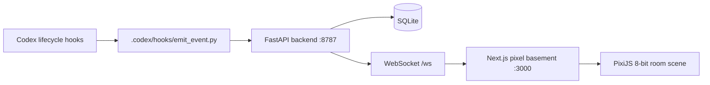

# Rick's Basement

**A secret command center for Codex.**

Rick's Basement is a local-first 8-bit animated Codex visualizer. It turns invisible agent activity into a tiny pixel-art basement lab where original mad-scientist variants walk around, work at machines, launch mini drones, panic at containment doors, and compress memory in a noisy little machine.

It does not spend tokens to do this. Rick's Basement listens to Codex lifecycle hooks, captures minimal local telemetry, and renders everything in real time.


## What It Is

- A private local telemetry viewer for Codex lifecycle events.
- A FastAPI and SQLite backend with WebSocket streaming.
- A Next.js, React, Tailwind, PixiJS, and Zustand pixel room.
- A set of small Python Codex hook scripts that fail silently when offline.

## What It Is Not

- Not an office simulator.
- Not a clone or reskin of another tool.
- Not a corporate SaaS dashboard.
- Not a serious glassy sci-fi cockpit.
- Not an LLM summarizer.
- Not a cloud service.

## Architecture



## Visual Direction

Rick's Basement is now a little animated basement, not a dashboard. Codex events drive original pixel scientist characters:

- Tool calls send the right character to a terminal, patch desk, or test rig.
- Permission requests send the paranoid lookout to the containment door.
- Memory compaction sends the archivist to the memory compressor.
- Subagents launch as mini drones from the drone bay.
- Failures briefly summon the glitch character and flash the room red.

The UI is intentionally game-like: pixel borders, hard shadows, limited colors, compact HUD overlays, and a PixiJS room scene as the main product.

## Visual QA

Before publishing screenshots or a demo GIF:

- Open [http://127.0.0.1:3000](http://127.0.0.1:3000) with the backend offline and confirm the pixel basement still looks alive.
- Confirm the room shows a back wall, floor, pipes, shelves, cables, machines, stations, and multiple original pixel scientist variants.
- Start the backend and run the simulator to confirm characters move between stations.
- Confirm permission events flash the containment door, compaction activates the memory machine, subagent events launch the mini drone, and failed tool events trigger glitch/error effects.
- The screenshot should read as a tiny animated indie-game lab, not a dashboard or placeholder canvas.

## Why No Copyrighted Sprites?

Rick's Basement is open source, so it uses original pixel scientist characters drawn procedurally in code. It does not ship copyrighted show sprites, screenshots, fan art, logos, dialogue, exact character likenesses, or character names from any TV series.

## Why It Does Not Waste Tokens

Rick's Basement observes lifecycle hooks and renders local telemetry. Hooks never call an LLM, never summarize prompts, never summarize tool output, and never print natural language that could become extra Codex context. The default privacy mode stores minimal structured metadata only.

## Privacy Model

Default mode is `minimal`.

- `minimal`: event type, visual state, timestamp, tool name, status, duration, and safe counters only.
- `balanced`: minimal fields plus short previews for safe metadata.
- `debug`: more local metadata, still redacted and truncated, explicitly enabled only.

Secrets are redacted aggressively. If a value looks like an API key, bearer token, cookie, password, private key, database URL, SSH key, env value, GitHub token, Supabase key, long token, or suspicious base64 string, it is replaced with `[REDACTED]`.

## Local-First Warning

Rick's Basement is designed for local development. It binds to localhost by default, stores events in a local SQLite file, and should not be exposed to the public internet without additional authentication and review.

## Install

Prerequisites:

- Python 3.11+
- `uv` preferred for Python setup
- Node.js 20+
- `pnpm`

```bash
make install
```

Manual setup:

```bash
cd backend
uv sync
cd ../frontend
corepack pnpm install
```

Windows PowerShell setup without `make`:

```powershell
cd backend
uv sync
cd ..\frontend
corepack pnpm install
```

## Run

```bash
make dev
```

Backend: [http://127.0.0.1:8787/api/health](http://127.0.0.1:8787/api/health)  
Frontend: [http://127.0.0.1:3000](http://127.0.0.1:3000)

Run services separately:

```bash
make backend
make frontend
```

Windows PowerShell without `make`:

```powershell
cd backend
uv run uvicorn app.main:app --host 127.0.0.1 --port 8787 --reload
```

In another shell:

```powershell
cd frontend
corepack pnpm dev
```

## Run Without Codex

Use simulated lifecycle events:

```bash
make simulate
```

Windows PowerShell without `make`:

```powershell
python .codex/hooks/simulate_events.py
py -3 .codex/hooks/simulate_events.py
```

The simulator sends a full session: session start, prompt submit, tool use, permission request, memory compaction, subagent start/stop, and stop.

## Codex Hooks Setup

Project hook configuration lives in `.codex/hooks.json`. Each lifecycle hook calls:

```bash
python .codex/hooks/emit_event.py <EventName>
```

Windows-compatible commands are included with `py -3`.

Install helper:

```bash
make hooks-install
```

Always review and trust project hooks before enabling them. These hooks are intentionally tiny, local, and token-free.

## Make Commands

- `make install`: install backend and frontend dependencies.
- `make dev`: run backend and frontend together.
- `make backend`: run FastAPI on port 8787.
- `make frontend`: run Next.js on port 3000.
- `make simulate`: send fake Codex events.
- `make test`: run backend, hook, and frontend tests.
- `make lint`: run Ruff, ESLint, and type checks.
- `make format`: format Python and frontend code.
- `make hooks-status`: print configured project hook events.
- `make hooks-install`: run the hook install helper.
- `make clean`: remove local caches and generated data.

## Roadmap

See [ROADMAP.md](ROADMAP.md).

## Contributing

See [CONTRIBUTING.md](CONTRIBUTING.md). Contributor experience is part of the product.

## Security

See [SECURITY.md](SECURITY.md). Do not file public issues containing secrets or private session data.

## License

Apache-2.0. See [LICENSE](LICENSE) and [NOTICE](NOTICE).
